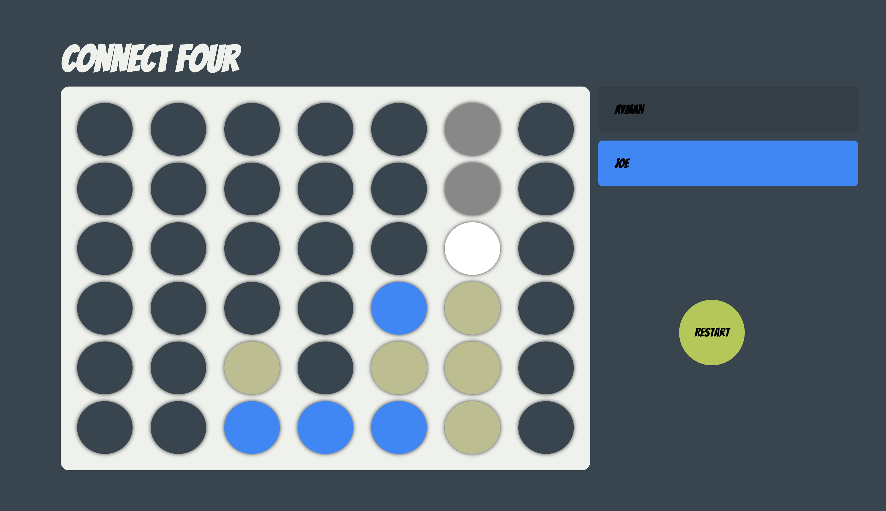
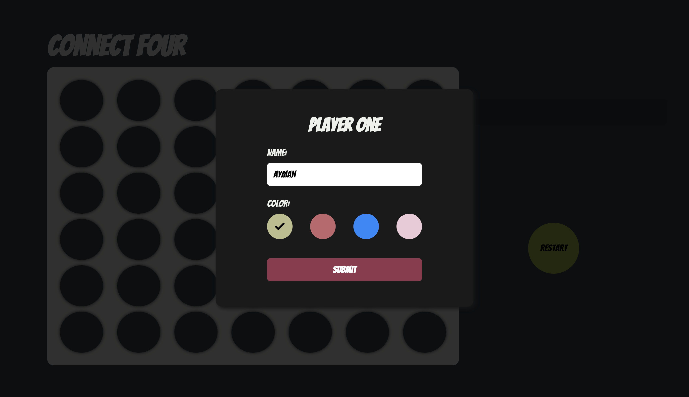
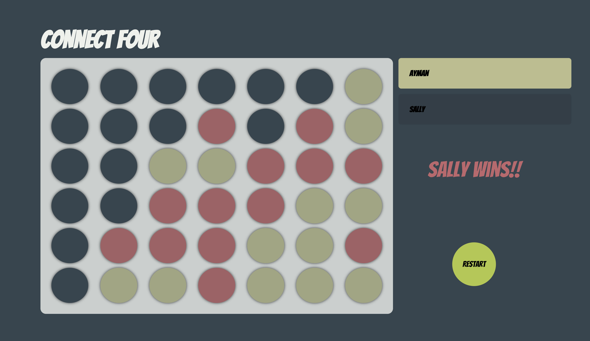

# Connect Four Game

This is an implementation of the famous Connect 4 game. The player drops pieces from the top of the board. One wins by connecting 4 pieces either vertically, horizontally or diagonally.

### Stacks Used

ReactJS with TypeScript

### Screenshots

| ---| ---| ---|
|  |  |  |

### Animated

| ---|
|  |

### How To Run

1. Clone the repo
   ```sh
   git clone https://github.com/aymanhajjar/Connect-Four.git
   ```
2. Install packages
   ```sh
   npm install
   ```
3. Run the app
   ```sh
   npm start
   ```
